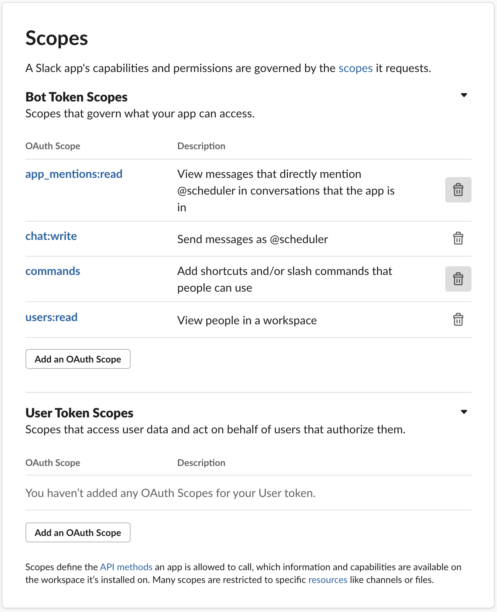
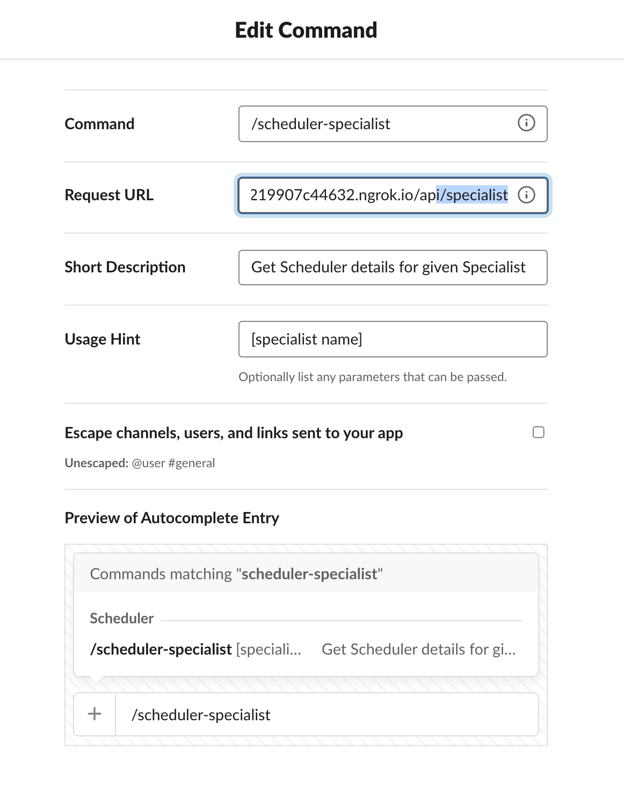

Slack Scheduler
===============

A node.js based proof-of-concept (POC) built for Slack and intended to mimic the workflows used by the Third Bridge [Scheduler v3 application](https://github.com/Third-bridge/scheduler).

### Screenshots

#### Specialist Commands Preview

#### Project Commands Preview

---

## Includes
- Express
- Node SDK Events API
- Node SDK Web Client
- Node SDK Interactive Messages API
- Use of Slack Block Kit

## User Features

| Command                  | Variables          | Description                                    |
| :----------------------- | :----------------: | ---------------------------------------------: |
|  /scheduler-specialist   | [specialist name]  | Get Scheduler details for the given Specialist |
|  /scheduler-project      | [project code]     | Get Scheduler details for the given Project    |
|  @Schedulebot            | no parameters      | Introduction to what Schedulebot can do        |

## Prerequisites
- A Slack workspace that you have access to as a development space
- Ngrok for API between local environment and Slack API

## Setup

### Create a Slack Application &amp; Bot

Navigate to `Create New App` in the Your Apps section at the [Slack Developer Site](https://api.slack.com/)

You will be prompted to enter a Slack Workspace that you have access to as a development space. This workspace represents your dev environment; your bot will be deployed here for testing and experimenting.

Next, we need to create a Bot User for our App.

### Create a Bot User

* Go to `App Home`
* Complete the fields for Bot Name (ScheduleBot) and Default Name
* Ensure `Always Show My Bot as Online` is enabled
* Select `OAuth & Permissions` on the side menu.

### Set OAuth Permission Scopes

Install your Bot User into the Slack Workspace with correct permission scopes
  - app_mentions:read
  - chat:write
  - commands
  - users:read

### Set up Ngrok and Event Subscriptions/Interactions

- [Create a URL with ngrok](https://api.slack.com/tutorials/tunneling-with-ngrok) for Node server to accept external events from Slack API
  * The ngok server can be started with: `ngrok http 3000`
  * Take note of the [Ngrok URL] generated - you will need to refer to this later
- Ensure Event Subscriptions in Slack API are enabled
  - Go to Event Subscriptions
  - Turn on Enable Events
  - Add [Ngrok URL] + /api/slack/events (e.g: http://219907c44632.ngrok.io/api/slack/events)

Inside the Event Subscriptions section, you should now have a verified Request URL. Next, we need to register to which events we want our bot to have access.

- Click Into `Subscribe to bot events`
- Click `Add Bot User Event`
- Search and add `app_mention` and `app_home_opened`
- Save your changes

### Set up Slack Commands

- Create two commands with the following detail:

| Command                  | Usage Hint         | Short Description                              |
| :----------------------- | :----------------: | ---------------------------------------------: |
|  /scheduler-specialist   | [specialist name]  | Get Scheduler details for the given Specialist |
|  /scheduler-project      | [project code]     | Get Scheduler details for the given Project    |
|  @Schedulebot            | no parameters      | Introduction to what Schedulebot can do        |

The `Request URL` will be the Ngrok URL we created earlier + `/api/specialist` and `/api/project`

---

## Troubleshooting

To make sure you own the URL you provide when registering it with Slack, Slack sends a challenge request. To accept the challenge, your server must respond with a specific reply.

Luckily, instead of building this functionality into our server, we can use a command-line utility built into the @slack/events-api package. To use it, we need our signing secret, which is available in the `Basic Information` section of the developer configuration. We also need the name of our events path.

> $ ./node_modules/.bin/slack-verify --secret <signing_secret> [--path=/api/slack/events] [--port=3000]\

When successfully run, you should see The verification server is now listening at the URL: http://:::3000/slack/events.

This command starts a server that correctly accepts the Slack Events API challenge.

soon as you enter this URL, Slack sends the challenge message. Our running verification server should correctly accept the challenge.

Once this URL is verified, we can stop the ./node_modules/.bin/slack-verify server.

---

